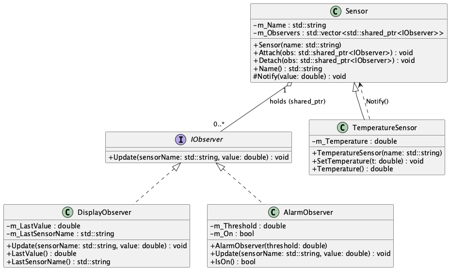

# SDA Lab 5 - Observer Pattern (C++17)

This exercise teaches the **Observer pattern** with **modern C++17** and **smart pointers**.

You are given:

- a working `CMakeLists.txt`
- a complete unit test `tests/test_observer.cpp`

Your task is to implement the missing classes so that **all tests pass**.

Here is the UML diagram of the classes:



## Observer Pattern – in one sentence

A **Subject** (Sensor) maintains a list of **Observers** and notifies them when its state changes.

## Build & Run

```bash
mkdir build
cd build
cmake ..
make
make test
```
